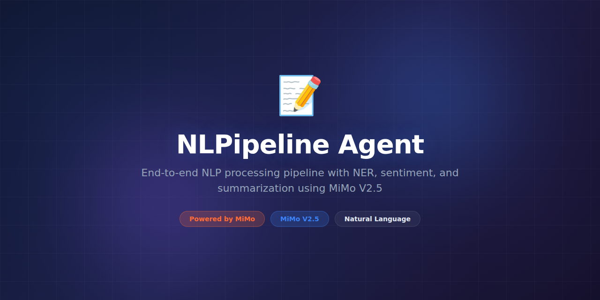

# NLPipeline-Agent



> **Powered by MiMo** — built on top of Xiaomi's [MiMo](https://platform.xiaomimimo.com) reasoning models for intelligent natural language processing pipelines.

[](https://opensource.org/licenses/MIT)
[](https://platform.xiaomimimo.com)

## Why MiMo

Building NLP pipelines traditionally requires stitching together a dozen specialized libraries — spaCy for NER, HuggingFace for classification, NLTK for preprocessing, custom regex for extraction — each with its own API, data format, and failure modes. MiMo's reasoning models let NLPipeline-Agent serve as a unified, intelligent orchestrator that selects the right tool for each task and reasons through complex linguistic challenges.

The reasoning capability is critical for ambiguous language tasks. Sarcasm detection, implicit sentiment, domain-specific jargon, and cross-lingual transfer all require understanding beyond pattern matching. MiMo reasons about context, pragmatics, and discourse structure to handle the edge cases where traditional NLP pipelines silently fail.

MiMo also enables rapid pipeline iteration. Describe your NLP task in natural language — "extract all product complaints and classify them by severity" — and NLPipeline-Agent builds, tests, and deploys the pipeline. No code required for prototyping; full Python control when you need it.

## Token consumption

| Agent | Model | Tokens/run | Frequency | Daily/user |
|---|---|---|---|---|
| Pipeline Planner | MiMo-14B | 6,500 | Per pipeline setup | ~6,500 |
| Text Analyzer | MiMo-7B | 3,800 | Per document | ~38,000 |
| NER Extractor | MiMo-7B | 3,200 | Per document | ~32,000 |
| Sentiment Classifier | MiMo-7B | 2,600 | Per document | ~26,000 |
| Summarizer | MiMo-14B | 5,400 | Per request | ~10,800 |
| **Total** | — | **21,500** | — | **~113,300** |

## What it does

NLPipeline-Agent is a unified NLP platform that chains together text preprocessing, named entity recognition, classification, sentiment analysis, summarization, and custom extraction into composable pipelines. MiMo orchestrates each stage, handles edge cases with reasoning, and lets you define pipelines in natural language or Python code.

## Why this exists

NLP is fragmented across dozens of libraries with incompatible interfaces. Teams spend more time gluing tools together than solving actual language problems. NLPipeline-Agent provides a single, intelligent entry point where you describe what you want to extract or understand from text, and the system assembles and runs the optimal pipeline.

## Features

- **Natural language pipeline definition** — describe your task in English, get a working pipeline
- **Composable stages** — mix and match NER, classification, sentiment, summarization, and custom stages
- **Intelligent error handling** — MiMo reasons through ambiguous text instead of returning low-confidence garbage
- **Domain adaptation** — provide domain glossaries and the system adapts its models and rules
- **Multi-language support** — 20+ languages with automatic language detection
- **Streaming mode** — process text streams in real-time for chat, social media, and log analysis
- **Evaluation framework** — built-in benchmarking with precision/recall/F1 tracking per pipeline stage
- **REST API and Python SDK** — embed in any application or run standalone
- **Pipeline versioning** — track, compare, and rollback pipeline configurations
- **A/B testing** — compare pipeline variants against labeled evaluation sets

## Tech Stack

- **Runtime:** Python 3.11+
- **AI Engine:** MiMo-7B and MiMo-14B via platform API
- **NLP Libraries:** spaCy 3.x, HuggingFace Transformers, sentence-transformers
- **API:** FastAPI with WebSocket streaming support
- **Storage:** PostgreSQL (metadata), Redis (cache, rate limiting)
- **Search:** Elasticsearch (corpus indexing)
- **Monitoring:** Prometheus + Grafana
- **Testing:** pytest, hypothesis (property-based)

## Quickstart

```bash
# Clone and install
git clone https://github.com/nousresearch/NLPipeline-Agent.git
cd NLPipeline-Agent
pip install -e ".[dev]"

# Download language models
python -m spacy download en_core_web_trf

# Set your API key
export MIMO_API_KEY="your-key-here"

# Run a quick analysis
nlpipeline analyze "The new firmware update caused frequent disconnections on Model X devices." \
  --tasks "sentiment,entities,complaint_detection"

# Define a pipeline in natural language
nlpipeline create "Extract product complaints from support tickets and classify severity as low/medium/high"

# Run pipeline on a file
nlpipeline run my_pipeline --input tickets.csv --output results.json

# Start the API server
uvicorn nlpipeline.server:app --host 0.0.0.0 --port 8000
```

## Project Structure

```
NLPipeline-Agent/
├── assets/
│   └── banner.png
├── nlpipeline/
│   ├── __init__.py
│   ├── cli.py                 # Command-line interface
│   ├── server.py              # FastAPI + WebSocket server
│   ├── engine.py              # Pipeline execution engine
│   ├── agents/
│   │   ├── pipeline_planner.py# Natural language pipeline builder
│   │   ├── text_analyzer.py   # Deep text understanding
│   │   ├── ner_extractor.py   # Named entity recognition
│   │   ├── sentiment.py       # Sentiment analysis agent
│   │   └── summarizer.py      # Abstractive summarization
│   ├── stages/
│   │   ├── base.py            # Stage interface
│   │   ├── preprocess.py      # Tokenization, normalization
│   │   ├── classify.py        # Text classification
│   │   ├── extract.py         # Information extraction
│   │   └── generate.py        # Text generation stages
│   ├── pipelines/
│   │   ├── builder.py         # Pipeline construction
│   │   ├── registry.py        # Pipeline storage/retrieval
│   │   └── versioning.py      # Pipeline version control
│   ├── evaluation/
│   │   ├── benchmark.py       # Evaluation framework
│   │   └── metrics.py         # NLP metrics (F1, BLEU, etc.)
│   └── utils/
│       ├── config.py          # Configuration management
│       └── language.py        # Language detection utilities
├── examples/
│   ├── sentiment_pipeline.yaml
│   ├── complaint_extractor.yaml
│   └── multilingual_pipeline.yaml
├── tests/
│   ├── unit/
│   ├── integration/
│   └── fixtures/
├── docker-compose.yml
├── pyproject.toml
└── README.md
```

## Contributing

Contributions are welcome! Please read our [Contributing Guide](CONTRIBUTING.md) before submitting a pull request.

1. Fork the repository
2. Create a feature branch (`git checkout -b feature/amazing-feature`)
3. Run the test suite (`pytest`)
4. Commit your changes (`git commit -m 'Add amazing feature'`)
5. Push to the branch (`git push origin feature/amazing-feature`)
6. Open a Pull Request

## License

This project is licensed under the MIT License — see the [LICENSE](LICENSE) file for details.

## Acknowledgments

- Built on top of [MiMo](https://platform.xiaomimimo.com) by Xiaomi
- NLP foundations from spaCy, HuggingFace, and the broader NLP community
- Thanks to all [contributors](https://github.com/nousresearch/NLPipeline-Agent/graphs/contributors)
